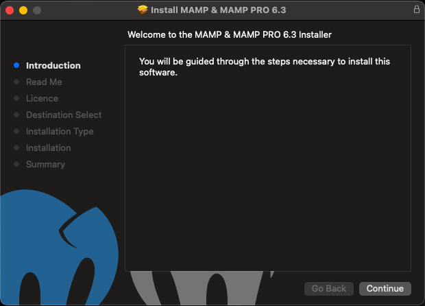
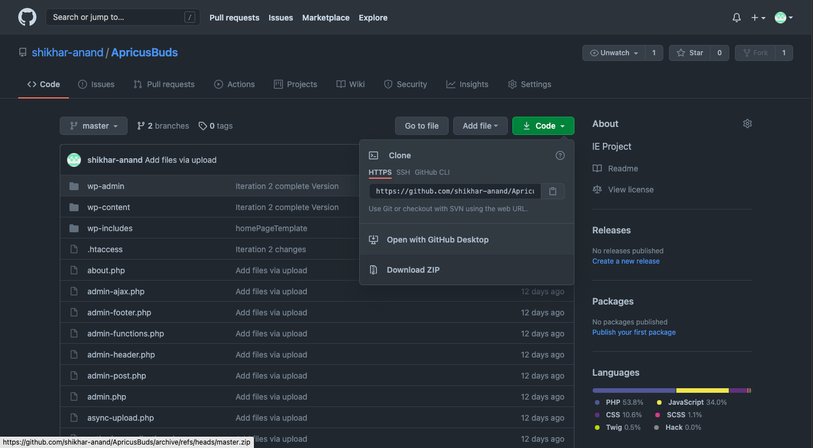
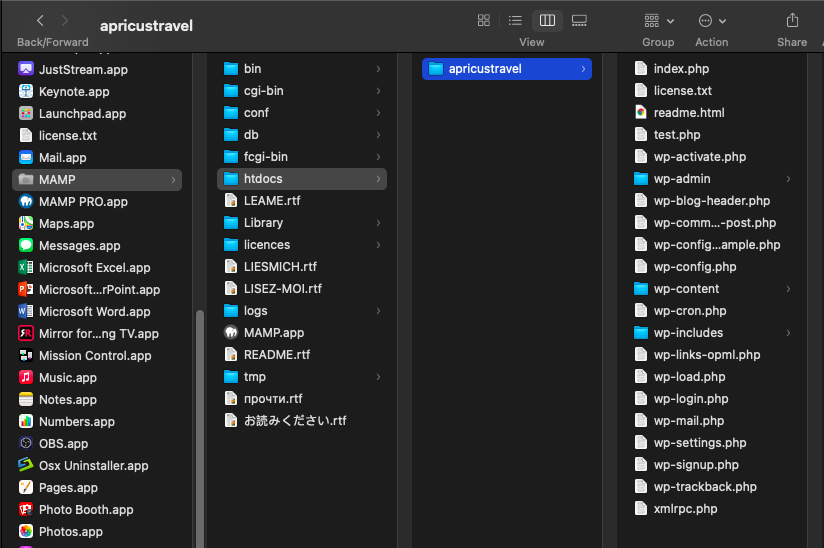
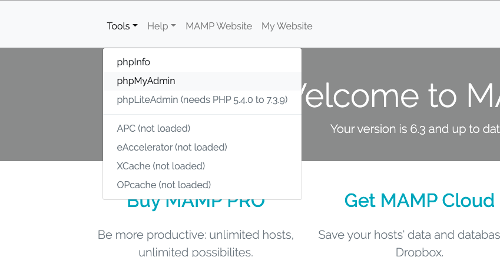
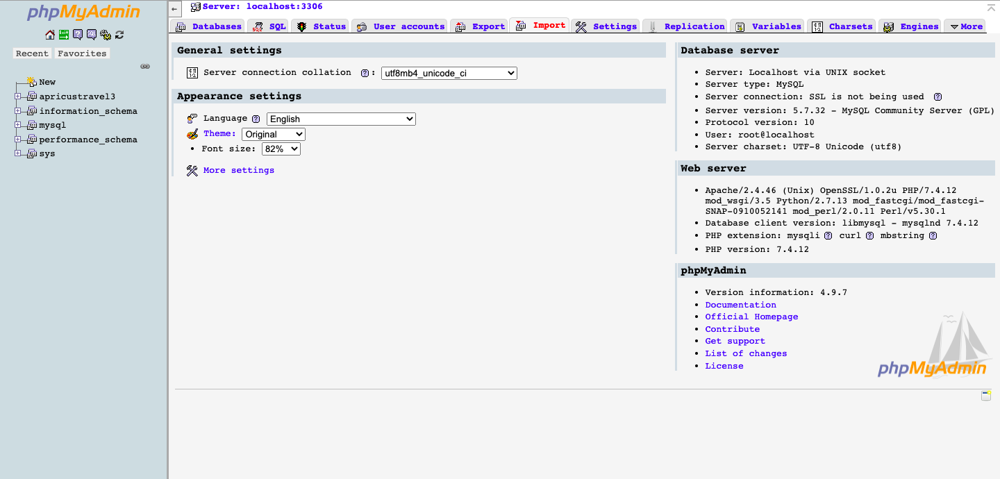

To setup the local environment

Step 1 – Downloading the free open source cross platform web server MAMPP  
For Windows: https://drive.google.com/file/d/1Ket9UT6cYbojQNlauShLeTb1JICuYYPa/view?usp=sharing  
For Mac: (https://drive.google.com/file/d/1KjZSdDQTyCNFMyG4xlkJXLlBKyJdgw5X/view?usp=sharing)

Step 2 – Install the downloaded package  
•	Double click on the .exe file for windows user or .pkg file for mac users. 
•	The below steps are for the mac users, but a similar popup will appear for windows users as well. 
•	The following installer window will pop up. 
  
•	Keep the default settings and select next at each step until you reach the finish screen 

Step 3 – Download the zipped folder from the repository  
Repository Link: https://github.com/shikhar-anand/ApricusBuds
  
 
To download the zipped folder, go to code and select download zip 
Step 4 – Extract the downloaded zip  
Step 5 – Copy all the content  
Step 6 – Create a folder named apricustravel inside the htdocs folder in MAMP 
 
 
Step 7 – Paste the copied content in that folder  
Step 8 – Download the database file localdb.sql: https://drive.google.com/file/d/1KaI8WueURXXg27-xpZM_IajlJY9SYzIa/view?usp=sharing 
Step 9 – Select phpMyAdmin in MAMP 
 

Step 10 – Once you are in phpMyAdmin, select Import  
 

Step 11 – Upload the downloaded database file localdb.sql from Choose file button and select go 
  
 

Step 12 – Stop and Start the MAMP and Click on WebStart 
   

Step 13: Click on My Website 
   

Step 14: Access the website: http://localhost/apricustravel/wp-admin/  

Step 15: Enter the login credentials  
Admin – admin 
Password – Apricus@123 

Step 16 - Start developing and modifying the website.  

THANK YOU 
